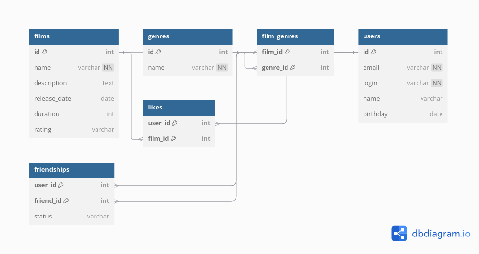

# java-filmorate
Template repository for Filmorate project.


# Схема базы данных Filmorate

В данном проекте используется реляционная база данных для управления информацией о пользователях, фильмах, жанрах и их связях. Схема базы данных разработана с учетом нормализации для обеспечения целостности данных и удобства выполнения запросов.

## Схема базы данных



### Таблицы и их описание

#### `films`
Хранит информацию о фильмах:
- **id** (PK) — уникальный идентификатор фильма.
- **name** — название фильма.
- **description** — описание фильма.
- **release_date** — дата выхода фильма.
- **duration** — продолжительность фильма в минутах.
- **rating** — возрастной рейтинг (MPAA).

#### `genres`
Содержит список доступных жанров:
- **genre_id** (PK) — уникальный идентификатор жанра.
- **name** — название жанра.

#### `film_genres`
Таблица-связка для отношения "многие-ко-многим" между фильмами и жанрами:
- **film_id** (FK, PK) — идентификатор фильма.
- **genre_id** (FK, PK) — идентификатор жанра.

#### `users`
Хранит информацию о пользователях:
- **id** (PK) — уникальный идентификатор пользователя.
- **email** — адрес электронной почты.
- **login** — логин пользователя.
- **name** — имя пользователя.
- **birthday** — дата рождения.

#### `friendships`
Отражает связи дружбы между пользователями:
- **user_id** (FK, PK) — идентификатор пользователя.
- **friend_id** (FK, PK) — идентификатор друга.
- **status** — статус дружбы (подтвержденная/неподтвержденная).

## Примеры SQL-запросов

### Получение всех фильмов
```sql 
SELECT * FROM films;
```
```
Table: films
-------------------------
| id (PK)               |
| name                  |
| description           |
| release_date          |
| duration              |
| rating (ENUM)         |

Table: genres
-------------------------
| genre_id (PK)         |
| name                  |

Table: film_genres
-------------------------
| film_id (FK, PK)      |
| genre_id (FK, PK)     |

Table: users
-------------------------
| id (PK)               |
| email                 |
| login                 |
| name                  |
| birthday              |

Table: friendships
-------------------------
| user_id (FK, PK)      |
| friend_id (FK, PK)    |
| status (ENUM)         |

```
```